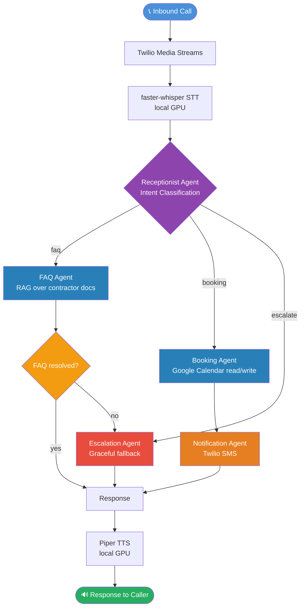

# Contractor Voice Bot (English)

An agentic AI voice bot that answers inbound phone calls for contractors,
handles service FAQs, books appointments, and sends multi-channel
notifications — fully autonomous, zero cost to run locally.

Built as a portfolio demonstration of production-grade agentic AI
architecture using open-source tooling.

---

## Demo Results

Tested across 10 inbound call scenarios:

| Metric                       | Result           |
| ---------------------------- | ---------------- |
| Autonomous resolution rate   | 100% (10/10)     |
| Intent routing accuracy      | 100%             |
| Average booking confirmation | under 90 seconds |
| Infrastructure cost          | $0               |

---

## Architecture



## Tech Stack

| Layer               | Tool                                        |
| ------------------- | ------------------------------------------- |
| Orchestration       | CrewAI                                      |
| RAG                 | LlamaIndex + ChromaDB                       |
| Embedding           | BAAI/bge-small-en-v1.5 (local)              |
| LLM                 | llama3.1:8b-instruct via Ollama (local GPU) |
| STT                 | faster-whisper (local)                      |
| TTS                 | Piper TTS (local)                           |
| Telephony           | Twilio Media Streams                        |
| Calendar            | Google Calendar API                         |
| SMS                 | Twilio SMS                                  |
| LLM tracing         | Arize Phoenix (self-hosted)                 |
| Experiment tracking | MLflow (self-hosted)                        |
| RAG evaluation      | RAGAS                                       |
| Metrics dashboard   | Grafana + Prometheus                        |

---

## The 5 Agents

**Receptionist** — Entry point for every call. Greets the caller and
classifies intent into `faq`, `booking`, or `escalate` using the LLM.
Includes a post-routing fallback that escalates when the FAQ agent
cannot resolve a query.

**FAQ agent** — Answers service questions using RAG over contractor
documents. Retrieves relevant chunks from ChromaDB and generates
concise, phone-appropriate answers grounded in the source documents.
Never fabricates information.

**Booking agent** — Extracts booking details from natural language
(date, time, service, name, phone). Resolves relative date references
like "next Tuesday" or "tomorrow morning" to exact dates. Confirms
the booking to the caller and triggers the Notification agent.

**Escalation agent** — Handles emergencies, complaints, garbled input,
and anything outside FAQ and booking scope. Responds empathetically
and provides a clear next step without making promises it cannot keep.

**Notification agent** — Routes booking confirmations to the contractor
and customer via Twilio SMS. Designed for multi-channel extension
(WhatsApp, Telegram) in the Indonesian repo variant.

---

## Observability Stack

All four tools run locally via Docker Compose:

| Tool          | URL                   | Purpose                                   |
| ------------- | --------------------- | ----------------------------------------- |
| Arize Phoenix | http://localhost:6006 | LLM call tracing, RAG span logging        |
| MLflow        | http://localhost:5000 | Prompt versioning, experiment tracking    |
| Prometheus    | http://localhost:9090 | Metrics scraping                          |
| Grafana       | http://localhost:3000 | Dashboards: call volume, latency, routing |

Start the stack:

```bash
cd docker
docker compose up -d
```

---

## Project Structure

agents/
├── receptionist.py # Intent classification + greeting
├── faq.py # RAG-powered FAQ answering
├── booking.py # Appointment extraction + confirmation
├── escalation.py # Graceful fallback handling
├── notification.py # Twilio SMS routing
└── pipeline.py # Full 10-scenario integration test
rag/
├── ingest.py # Document chunking + ChromaDB ingestion
├── query.py # Ollama-powered retrieval query engine
└── evals/
├── ragas_suite.py # Full RAGAS eval (requires LLM)
└── ragas_suite_non-llm.py # RougeL baseline (no LLM needed)
observability/
└── phoenix_tracer.py # Arize Phoenix tracer initialisation
voice/ # Phase 4: Twilio Media Streams + STT/TTS
integrations/ # Phase 3: Google Calendar + Twilio SMS
contractor_docs/
└── contractor_en.md # Source FAQ document (ABC Plumbing & HVAC)
docker/
├── docker-compose.yml # Full observability stack
└── prometheus.yml # Prometheus scrape config

---

## Setup

**Requirements:**

- Python 3.11+
- Docker Desktop
- Ollama running on a GPU machine (local or networked)

**1. Clone and install:**

```bash
git clone https://github.com/evlogia-kyriou/contractor-voice-bot-en.git
cd contractor-voice-bot-en
python -m venv .venv
.venv\Scripts\Activate.ps1  # Windows
pip install -e ".[dev]"
```

**2. Configure environment:**

```bash
cp .env.example .env
# Edit .env with your OLLAMA_BASE_URL and model settings
```

**3. Pull the LLM:**

```bash
ollama pull llama3.1:8b-instruct-q4_K_M
```

**4. Start observability stack:**

```bash
cd docker
docker compose up -d
```

**5. Build the RAG index:**

```bash
python -m rag.ingest
```

**6. Run the full pipeline test:**

```bash
python -m agents.pipeline
```

---

## Companion Repository

The Indonesian variant of this project uses LlamaIndex Workflows
instead of CrewAI for orchestration, Whisper + Google TTS for the
voice layer, and adds WhatsApp and Telegram notification channels.

[contractor-voice-bot-id](https://github.com/evlogia-kyriou/contractor-voice-bot-id)

---

## Roadmap

- [ ] Phase 3: Google Calendar OAuth + real Twilio SMS
- [ ] Phase 4: Twilio Media Streams + faster-whisper + Piper TTS
- [ ] Phase 5: Full Arize Phoenix + Grafana instrumentation
- [ ] Phase 6: End-to-end demo recording

---

## License

MIT
